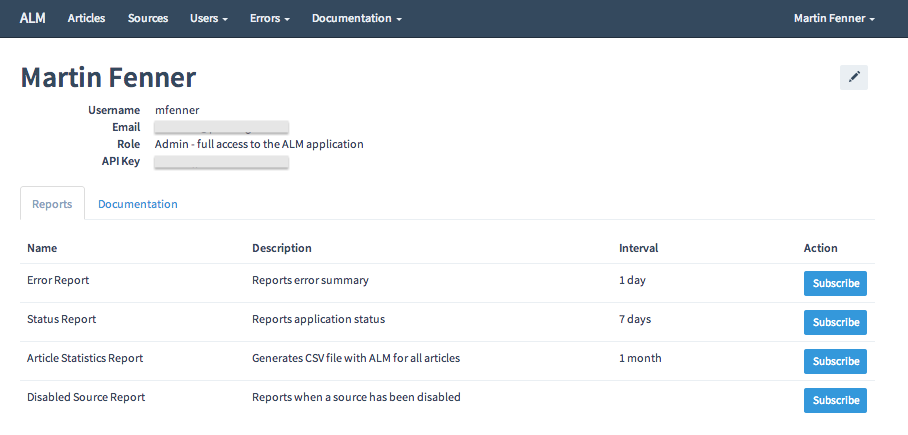
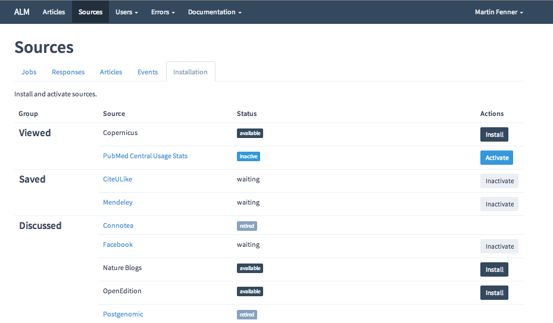

To configure the ALM application, the following steps are necessary:

* add users (we need at least one admin user)
* configure sources
* add articles (or seed a set of sample articles)
* start workers (start collecting data from external APIs)
* configure maintenance tasks (only in production system)

## Adding Users
The ALM application supports the following user roles:

* API user - only API key
* staff - read-only access to admin area
* admin - full access to admin area

The ALM application supports the following forms of authentication:

* username/password ([Login](/users/sign_in)) for admin and staff users
* authentication with [Mozilla Persona](http://www.mozilla.org/en-US/persona/) for all user roles
* authentication with CAS (currently PLOS only)

The first user created in the system automatically has an admin role, and this user can be created with any of the authentication methods listed above. From then on all user accounts are created with an API user role, and users have to create their own account using third-party authentication with Persona (or CAS). Admin users can change the user role after an account has been created, but can't create user accounts

Third-party authentication is configured in `config/settings.yml`. To use Persona, make sure the folling setting exists: `persona: true` (the default). No other configuration is necessary. Authentication via username/password is always enabled.



Users automatically obtain an API key, and they can sign up to the monthly report in CSV format. Admin users can sign up for additional reports (error report, status report, disabled source report).

## Configuring Sources

Unless this has already been done during installation, sources have to be installed and activated through the web interface `Sources -> Installation`:



All sources can be installed, but some sources require additional configuration settings such as API keys before they can be activated. The [documentation for sources](Sources) contains information about how to obtain API keys and other required source-specific settings.

The following addiotional configuration options are available via the web interface:

* whether the source is automatically queueing jobs and not running via cron job (default true)
* whether the results can be shared via the API (default true)
* number of max. workers for the job queue (default 1)
* job_batch_size: number of articles per job (default 200)
* batch_time_interval (default 1 hour)
* staleness: update interval depending on article publication date (default daily the first 31 days, then 4 times a month up until one year, then monthly)
* rate-limiting (default 10,000)
* timeout (default 30 sec)
* maximum number of failed queries allowed before being disabled (default 200)
* maximum number of failed queries allowed in a time interval (default 24 hours)
* disable delay after too many failed queries (default 10 sec)


Through these setup options the behavior of sources can be fine-tuned, but the default settings should almost always work. The default rate-limiting settings should only be increased if your application has been whitelisted with that source.

## Adding Articles
Articles can be added in one of several ways:

* admin dashboard (admin user)
* seeding of sample articles
* command line rake task
* API

Adding or changing articles via the admin dashboard is mainly for testing purposes, or to fix errors in the title or publication date of specific articles.

### Seeding articles
A set of about 30 sample articles is loaded during installation when using Vagrant and `seed_sample_articles` in `node.json`is set to `true`. They can also be seeded later via rake task:

```sh
rake db:articles:seed
```

### Command line rake task
We can use a rake command line task to automate the import of a large number of articles. The import file (e.g. IMPORT.TXT) is a text file with one article per line, and the required fields DOI, publication date and title separated by a space:

```sh
DOI Date(YYYY-MM-DD) Title
```

The rake taks loads all these articles at once, ignoring (but counting) invalid ones and those that already exist in the database:

```sh
rake db:articles:load <IMPORT.TXT
```

In a production environment this rake task (like all other rake tasks used in production) has to be slightly modified to:

```sh
bundle exec rake db:articles:load <IMPORT.TXT RAILS_ENV=production
```

The rake task splits on white space for the first two elements, and then takes the rest of the line (title) as one element including any whitespace in the title.

Most users will automate the importing of articles via a cron job, and will integrate the rake task into a larger workflow.

### API

Articles can also be added (and updated or deleted) via the v4 [API](API). The v4 API uses basic authentication and is only available to admin and staff users. A sample curl API call to create a new article would look like this:

```sh
curl -X POST -H "Content-Type: application/json" -u USERNAME:PASSWORD -d '{"article":{"doi":"10.1371/journal.pone.0036791","published_on":"2012-05-15","title":"Test title"}}' http://HOST/api/v4/articles
```

See the [API](API) page for more information, e.g. how to upate or delete articles.

## Starting Workers
The ALM application talks to external data sources to collect metrics about a set of articles. This can be done in one of two ways:

### Ad-hoc workers
To collect metrics once for a set of articles, or for testing purposes the
Metrics are added by calling external APIs in the background, using the [delayed_job](https://github.com/collectiveidea/delayed_job) queuing system. The results are stored in CouchDB. When we have to update the metrics for an article (determined by the staleness interval), a job is added to the background queue for that source. A delayed_job worker will then process this job in the background. We need to run at least one delayed_job to do this.

To have foreman detect the development environment, make sure the file `.env` in the root folder of your application has the following content:

```sh
RAILS_ENV=development
```
You can then start the workers with:

```sh
foreman start
```

To stop all background processing, kill foreman with `ctrl-c`.

### Background workers
In a continously updating production system we want to run the workers in the background. This can be done in several ways, the recommended approach is to use the [Upstart](http://upstart.ubuntu.com/) system utility that is used by many Linux distributions. The scripts needed by Upstart can be created using the [foreman](https://github.com/ddollar/foreman) utility that is installed with the ALM application. To have foreman detect the production environment, make sure the file `.env` in the root folder of your application has the following content:

```sh
RAILS_ENV=production
```

This file is created automatically if you use Vagrant. Use the path to the Rails log folder and the username of the user running the application:

```sh
sudo foreman export upstart -a alm /etc/init -l /PATH_TO_LOG_FOLDER/log -u USER -c worker=3
```

This command creates three upstart scripts that will run in parallel. The number of workers you will need depends on the number of articles (and sources) and the available RAM on your server, a rough estimate is one worker per 5,000-10,000 articles and 5 workers for a 2 Gb server.

Once the upstart scripts have been created, the background processes can then be started or stopped using Upstart:

```sh
sudo start alm
sudo stop alm
```

Foreman also supports bluepill, inittab and runit, read the [man page](http://ddollar.github.io/foreman/) for more information.

## Configuring Maintenance Tasks
The ALM application uses a number of maintenance tasks in production mode - they are not necessary for a development instance.

Many of the maintenance taks are `rake` tasks. All rake tasks are issued from the application root folder. You want to prepend your rake command with `bundle exec` and `RAILS_ENV=production` should be appended to the rake command when running in production, e.g.

```sh
bundle exec rake db:articles:load <IMPORT.TXT RAILS_ENV=production
```

### Cron jobs
The ALM application uses the [Whenever](https://github.com/javan/whenever) gem to make it easy to generate cron jobs. The configuration is stored in `config/schedule.rb` and can be displayed in cron format by:

```sh
whenever
```
